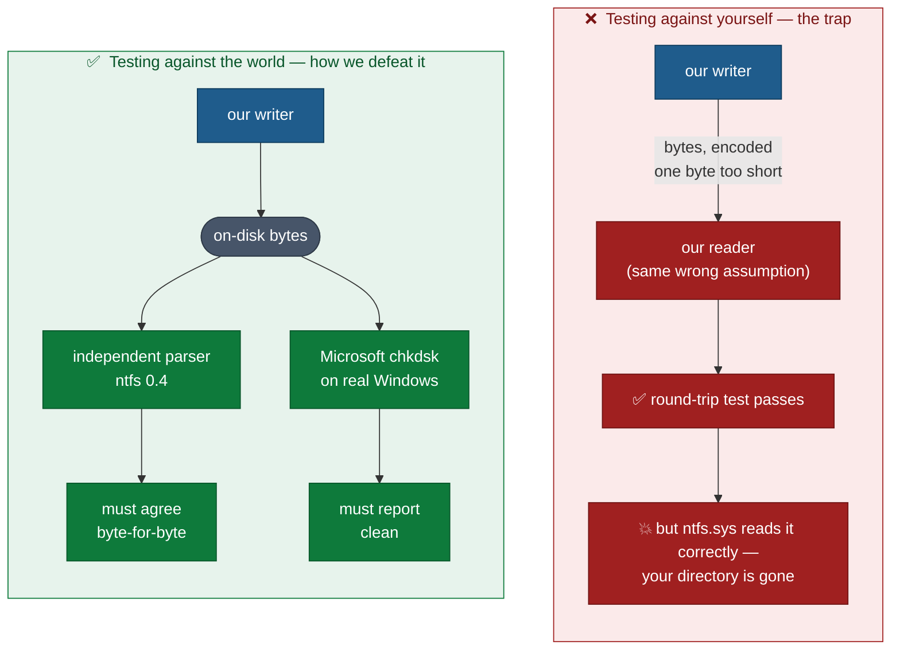
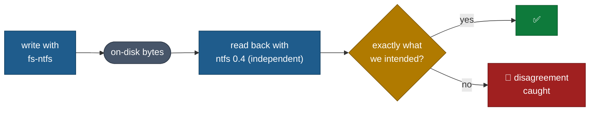
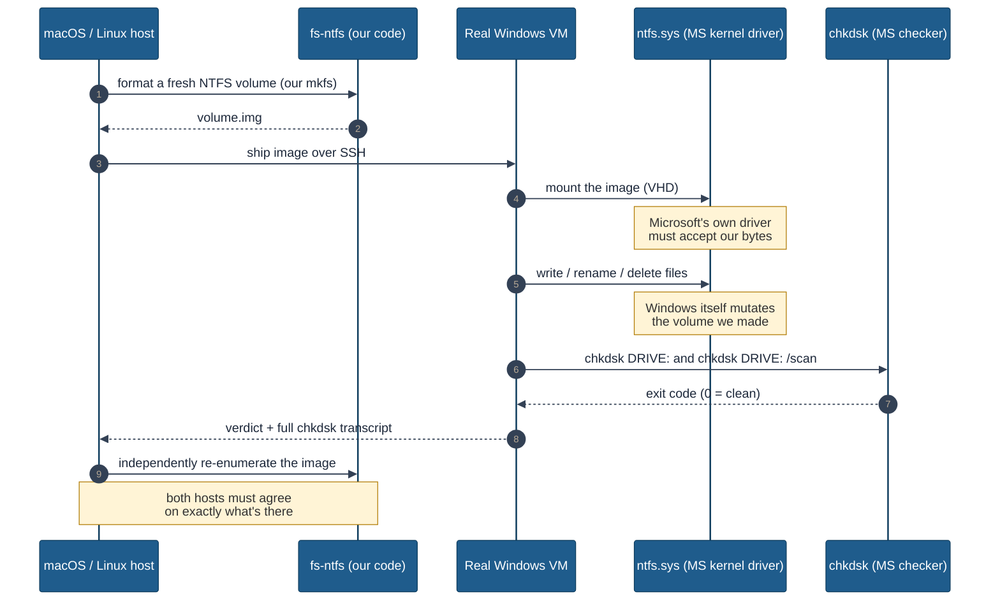
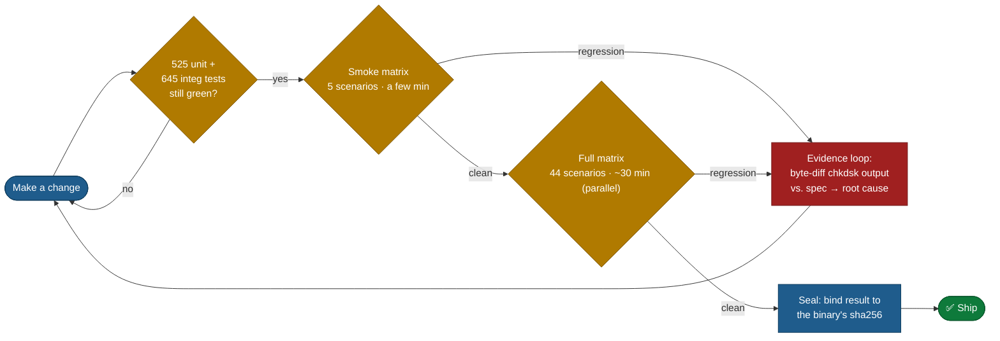

# 01 — Strategy & the Validation Contract

> *"Trust me, it works" is not a test strategy. This document explains the one
> standard we hold ourselves to, why it is the right standard for data safety,
> and why it is genuinely hard to fake.*

---

## The problem with testing a filesystem

Most software can be tested against itself. You write a function, you write a
test that calls it, the test asserts the answer. If both agree, you ship.

A filesystem driver cannot get away with that, and here is the trap: **a write
bug and a read bug can cancel out.** Suppose our writer encodes a field one byte
too short. If our *own* reader makes the same off-by-one assumption, our own
round-trip test passes — green check, everyone goes home — and then the day you
mount that volume on Windows, `ntfs.sys` reads the field correctly, sees garbage,
and your directory is gone.

So the entire strategy is built to make sure our reader and our writer can never
quietly collude. We do that with two independent checks at two levels.

---

## Contract level 1: two independent parsers must agree

Every write the driver makes is read back by **a different, independently written
parser** — the upstream `ntfs = "0.4"` crate (Colin Finck's read-only NTFS
parser, MIT/Apache-2.0, not written by this project). The test pattern is:

Because the read-back parser shares none of our write-side code, it shares none
of our write-side assumptions. If we encode a data run, an EA, a filename, or a
timestamp wrong, the independent parser surfaces the disagreement. This is what
the round-trip and remount tests (`mkfs_roundtrip.rs`, `remount_consistency.rs`,
`format_populate_remount.rs`, and the `field_exhaustion_*` suite) enforce.

This is necessary but **not sufficient** — two Rust parsers could in principle
still share a blind spot about what Windows actually accepts. That is what level
2 is for.

---

## Contract level 2: Microsoft's own tools are the final judge

The authoritative test is brutally simple and impossible to fake:

Why this is the right bar for *your* data:

- **`ntfs.sys` is the program your data will actually face.** Not an emulator,
  not a clone — the real Microsoft kernel driver, on a real Windows build. If it
  mounts our volume and writes to it without complaint, that is the literal
  production environment.
- **`chkdsk /scan` is Microsoft's own definition of "healthy."** It is the same
  tool a Windows admin runs to decide whether a disk is trustworthy. We hold our
  output to *their* checker, in two modes: read-only repair-detection and the
  deep `/scan` consistency pass.
- **The check is adversarial and external.** We cannot tune `chkdsk` to be
  lenient; it is a sealed Microsoft binary. Either it returns "clean" or it does
  not. There is no partial credit and nothing we can fudge.

This is why the project's headline claim is phrased the way it is:

> *Mount + write of freshly-formatted volumes is validated end-to-end against
> Microsoft's `chkdsk` running on real Windows VMs — that's the test contract,
> not byte-equivalence with any third-party tool.*

### The milestone that proves it is real

Producing a from-scratch NTFS volume that Microsoft's kernel will *mount and
write to* — and that `chkdsk /scan` calls clean — was a multi-month effort. The
breakthrough date is recorded: **2026-05-02**, the first time the pure-Rust
formatter produced volumes that `ntfs.sys` mounted and accepted writes on. A
second milestone, **2026-05-24**, is when `chkdsk /scan` first exited `0` on the
first online scan of every freshly-formatted volume. These are not aspirational
dates; they are recorded against specific commits in the changelog.

---

## The layered defense, and what each layer is *for*

No single layer is trusted to catch everything. They are arranged cheapest-and-
fastest first, so that the overwhelming majority of bugs die in milliseconds and
only the survivors cost VM time.

| Layer | Speed | Catches | Where |
|-------|-------|---------|-------|
| **Unit tests** (525) | ms | Wrong bytes at the encode/decode boundary, off-by-one in a single function | [04](04-on-disk-format.md) |
| **Integration tests** (645) | seconds | Wrong behavior through the *public* API; reader↔writer disagreement | [02](02-read-path.md), [03](03-write-path.md) |
| **Substrate tests** (88) | ms | Bugs in the block-device / cache / FFI layer *below* NTFS | [07](07-substrate-and-c-abi.md) |
| **Field-exhaustion** (66) | seconds | Boundary corruption — the 0/1/max/max+1 cases | [04](04-on-disk-format.md) |
| **Corruption suite** (20) | seconds | Panics, hangs, or UB on malformed/hostile images | [05](05-robustness-and-fuzzing.md) |
| **Fuzzers** (3, continuous) | hours | The hostile inputs *we never thought to write a test for* | [05](05-robustness-and-fuzzing.md) |
| **chkdsk VM matrix** (44) | hours | Anything Windows cares about that all the above missed | [06](06-windows-chkdsk-matrix.md) |

A change must survive **every** layer. The fast layers run on every commit; the
chkdsk matrix is still too slow to run per-commit — even fully parallelized
across the VM job pool it takes ~30 minutes — so it runs once per pull request at
the branch tip and is *sealed* — see
[06](06-windows-chkdsk-matrix.md) for how a commit is cryptographically tied to
the matrix run that validated it.

---

## How a change earns the right to ship

Every code change that touches the on-disk format runs through a disciplined loop
before it is allowed to land. This is not aspirational process — it is encoded in
the project's development skills (`dev-loop`, `corroborated-debug`) and enforced
by pre-commit hooks (`cargo fmt --check` + `cargo clippy -D warnings`).

The key discipline — and the reason this is a *trust* document and not a
marketing brochure — is the rule encoded in `corroborated-debug`: **no fix is
accepted on a hunch.** Every change to the format must cite either (a) a
byte-level diff between `chkdsk`'s complaint and the spec, or (b) a public
authority (Microsoft's MS-FSCC, *Windows Internals*). "I tried it and the error
went away" is explicitly not good enough, because a change that merely silences
one `chkdsk` complaint can easily introduce a subtler corruption elsewhere.

---

## Why you can check all of this

Everything in this set is designed to be falsifiable by you:

- The Rust counts are `grep` and `cargo test` one-liners (see the
  [index](README.md)).
- The chkdsk matrix records, for every scenario, the exact Windows build, the
  `ntfs.sys` version, the `chkdsk` version, and the raw exit codes — see the
  sealed `test-diagnostics/matrix-results.json` and
  [06](06-windows-chkdsk-matrix.md).
- The honest limitations are enumerated, not buried — see
  [08](08-coverage-and-honest-limits.md).

If any claim in these documents does not match what the commands produce, that is
a bug in the documentation and should be reported. The whole point is that you do
not have to take our word for it.

---

**Next:** [02 — The read path →](02-read-path.md)
