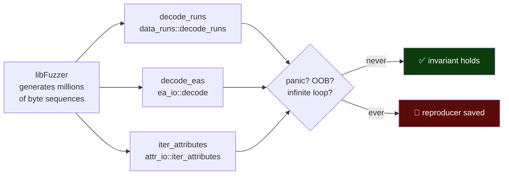

# 05 — Robustness, Corruption & Fuzzing

> *A filesystem driver does not get to assume the disk is well-formed. Disks get
> truncated mid-write, sectors rot, USB sticks get yanked, and attackers craft
> malicious images on purpose. The rule here is absolute: **on any input, the
> driver returns a clean error — it never panics, never hangs, and never
> corrupts.***

There are two failure modes a filesystem driver must never have:

1. **Crash on bad input** — a panic or out-of-bounds access turns a recoverable
   "this disk is damaged" into a process abort (or, in a kernel/FFI context, far
   worse).
2. **Silent corruption** — accepting a malformed structure and then *writing*
   based on it, turning a partially-damaged volume into a totally-lost one.

This layer exists to prove neither can happen. It has three parts: targeted
corruption tests, randomized bit-flip tests, and continuous fuzzing.

---

## The threat model

```
   well-formed image  ──▶  fs-ntfs  ──▶  correct result
                                  
   TRUNCATED image    ──▶  fs-ntfs  ──▶  Err(...)        ✅  not a panic
   WIPED boot sector  ──▶  fs-ntfs  ──▶  Err(...)        ✅  not a panic
   CORRUPT MFT magic  ──▶  fs-ntfs  ──▶  Err(...)        ✅  not a panic
   RANDOM bit-flips   ──▶  fs-ntfs  ──▶  Err(...)/ok     ✅  never UB
   HOSTILE crafted    ──▶  fs-ntfs  ──▶  Err(...)        ✅  never OOB
                                            │
                                            └─ what it must NEVER do:
                                               💥 panic   🔁 hang
                                               🩸 read out of bounds
                                               🗑️  write based on garbage
```

---

## Part 1 — Targeted corruption (`corruption_resistance.rs`, 6 tests)

These tests format a *valid* volume and then deliberately break one specific
structure, asserting the driver rejects it cleanly. They are surgical: each one
isolates a single corruption so a failure points straight at the cause.

| Test | Corruption injected | Required behavior |
|---|---|---|
| `non_power_of_two_sectors_per_cluster_rejected` | BPB byte `0x0D` set to 3 | mount **rejects** (invalid geometry) |
| `zero_bytes_per_sector_rejected` | BPB bytes `0x0B..0x0C` zeroed | mount **errors** |
| `wiped_boot_sector_resistance_no_panic` | entire boot sector zeroed | **no panic** |
| `corrupt_mft_magic_does_not_panic` | "FILE" magic clobbered | **no panic** |
| `truncated_image_resistance_no_panic` | image chopped in half | **no panic** |
| `zeroed_mft_region_does_not_panic` | 64 KiB from MFT start zeroed | **no panic** |

The "no panic" tests wrap the operation in a panic-catcher (`catch_unwind`) and
fail the test if the driver unwinds. Returning an error is fine; crashing is not.

---

## Part 2 — Randomized bit-flips (`corruption_fuzz.rs`, 7 tests)

Where Part 1 breaks one known structure, Part 2 flips *random* bits in a real
image and checks the driver survives. Randomness is **seeded** (a deterministic
LCG) so every run is reproducible — a failure can be replayed exactly.

```
   single_bit_flip_boot_region_does_not_panic     ←  1 flip
   random_flips_5_do_not_panic                     ←  5 flips   (seed 0xDEAD_BEEF_CAFE_0005)
   random_flips_20_do_not_panic                    ← 20 flips
   random_flips_100_do_not_panic                   ← 100 flips
   random_flips_500_do_not_panic                   ← 500 flips  (heavy damage)
   wiped_first_sector_does_not_panic               ← boot sector → 0
   truncated_image_does_not_panic                  ← truncate to 64 KiB
```

Every one asserts, via `catch_unwind`, that the driver does not unwind regardless
of how badly the image is mangled. The escalation from 1 → 500 flips means both
"barely damaged" and "shredded" images are covered.

---

## Part 3 — Continuous fuzzing (libFuzzer, 3 targets)

Hand-written tests cover the inputs we *thought of*. Fuzzing covers the ones we
did not. The three fuzz targets point libFuzzer (`cargo +nightly fuzz run`) at the
three decoders most likely to mishandle adversarial bytes — the same codecs from
[04](04-on-disk-format.md):



| Target | Decoder under fire | Why it is fuzzed |
|---|---|---|
| `decode_runs` | data-run mapping pairs | variable-length signed-delta encoding; off-by-one in the length nibbles is easy and catastrophic |
| `decode_eas` | `FILE_FULL_EA_INFORMATION` list | `u32` next-offset + `u8` name-len + `u16` value-len with alignment padding; misalignment/truncation exposes bounds bugs |
| `iter_attributes` | MFT attribute walker | chases `attribute_length` fields to a `0xFFFFFFFF` terminator; a malformed length is a classic OOB |

The invariant for all three: **no panic, no out-of-bounds read, no infinite
loop** — errors are acceptable, crashes are not. Because Rust's bounds checking
turns most OOBs into panics, "no panic" is a strong safety statement here, and the
crate is also exercised under AddressSanitizer in CI (nightly, `-Zsanitizer=address`)
to catch anything that slips below the safe-Rust layer.

---

## Why panic-safety is the whole ballgame for your data

Consider what a panic *means* in each deployment:

- **As a library in an app** — the app crashes. Annoying, but your data on disk
  is untouched because the write never completed.
- **Behind the C ABI in another language** — undefined behavior across the FFI
  boundary unless the panic is caught. The corruption suite proves the panic does
  not happen in the first place.
- **The subtle one** — a driver that panics *halfway through a write* can leave
  the volume in a torn, inconsistent state. By proving the parse/decode layer
  never panics on bad input, we ensure the driver *decides* "this is damaged,
  return an error" *before* it starts mutating, rather than discovering the
  damage mid-write.

That last point is the connection to data safety: **fail before you write, not
during.** The driver also treats the on-disk format as sacred — bogus offsets
surface as `UnexpectedEof`, an error, never as a wild memory access.

---

## Regression guard: the decoder benchmarks

`benches/byte_decoders.rs` (Criterion) is not a correctness test — it is a
performance *regression* guard for those same three hot decoders, plus the
security-descriptor hash. If a future refactor accidentally makes
`decode_runs` quadratic, the benchmark surfaces it. It is run on demand
(`cargo bench --bench byte_decoders`), not in the per-commit budget, because
Criterion needs warm-up samples.

| Benchmark group | Cases |
|---|---|
| `bench_decode_runs` | single run, eight-run zigzag, sparse-then-data |
| `bench_encode_runs` | single, eight mixed sparse, encode→decode round-trip |
| `bench_decode_eas` | single small EA, sixteen short EAs |
| `bench_iter_attributes` | minimal three-attribute record |
| `bench_sdh_hash` | 100-byte, 512-byte, 3-byte-remainder SDs |

---

**Next:** [06 — The Windows `chkdsk` matrix →](06-windows-chkdsk-matrix.md)
