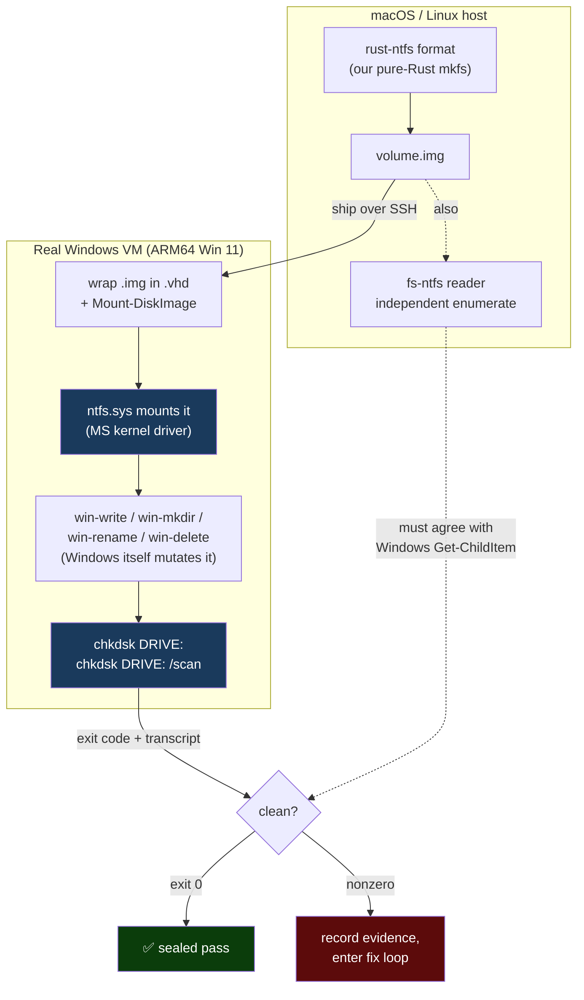
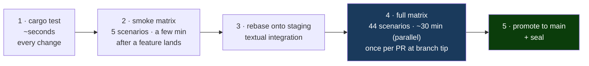

# 06 — The Windows `chkdsk` Matrix

> *This is the heart of the trust argument. Everything else proves we agree with
> ourselves. This proves we agree with **Microsoft** — on a real Windows machine,
> judged by Microsoft's own tools.*

The matrix takes volumes produced by our pure-Rust code, ships them to a **real
Windows VM**, mounts them with **`ntfs.sys`** (the actual Microsoft kernel
driver), lets Windows itself read/write/rename/delete on them, and then runs
**`chkdsk`** — Microsoft's own filesystem checker — to deliver the verdict.

There is no way to fake this. `chkdsk` is a sealed Microsoft binary; `ntfs.sys`
is the program your data will face the day the disk meets a Windows box. Either
they accept our volume or they do not.

---

## The end-to-end flow



The double check matters: `chkdsk` proves the volume is *structurally* clean, and
the independent host-side re-enumeration proves both hosts *agree on what files
exist* — catching a volume that is technically valid but lost a file.

---

## The harness

The orchestration lives in two places: filesystem-specific PowerShell operations
in `scripts/fs-test-harness/`, and a reusable, filesystem-agnostic runner
vendored at `vendor/fs-test-harness/` (its own MIT-licensed project, currently
v3.9.0).

**Windows-side operations** (`scripts/fs-test-harness/*.ps1`), each invoked over
SSH against a freshly mounted volume:

| Script | Operation |
|---|---|
| `win-format.ps1` | format a blank image with Windows' own NTFS (reference oracle) |
| `win-chkdsk.ps1` | mount, run `chkdsk` read-only **and** `/scan`, capture exit codes, dismount |
| `win-enumerate.ps1` | recursively walk the volume; compare against the host reader |
| `win-write.ps1` / `win-write-many.ps1` | write one / many files |
| `win-delete.ps1` / `win-delete-many.ps1` | delete one / a range |
| `win-mkdir.ps1`, `win-rename.ps1`, `win-modify.ps1`, `win-read.ps1` | dir create, rename, byte-range overwrite, byte-range read |
| `win-repeat-mount.ps1` | mount/dismount N times (mount-lifecycle stress) |
| `_lib.ps1` | shared VHD mount/dismount + a drive-letter mutex so parallel runs don't collide |
| `vm-info.ps1`, `verdict-collect.ps1` | capture VM/tool versions; aggregate verdicts |

**What `chkdsk` exit codes mean** in the harness:

```
   0   clean                         ← the goal
   3   errors found (structural)
   11  specific sector/range issue   ← an intermediate "ceiling" some scenarios reach
   13  deep structural ceiling       ← known frontier (upcase + frs.cxx assert)
```

---

## The scenario matrix

`test-matrix.json` defines the scenarios as recipes — ordered op lists
(`init-image` → `mac-format` → `ship-to-vm` → `win-*` → `win-chkdsk`) over a grid
of volume parameters.

**Coverage axes** (across the 44 scenarios):

```
   Volume size:   32 MiB │ 64 MiB │ 256 MiB │ 1 GiB │ 4 GiB │ 16 GiB
   Cluster size:  512 B  │ 1 KiB  │ 4 KiB   │ 8 KiB │ 64 KiB
   Volume label:  empty  │ ASCII  │ 32-char │ Latin-1 │ CJK │ emoji
   Op pattern:    empty │ tiny │ 4 KiB │ 4 MiB (non-resident) │ 256×16 B
                  │ deep nesting │ long names │ Unicode │ sparse
```

The bulk of scenarios pin a 256 MiB / 4 KiB baseline and vary one axis at a time,
so a failure isolates to the dimension under test, with a handful of scenarios at
the extreme sizes (32 MiB, 16 GiB) and cluster sizes (512 B, 64 KiB) where shift
and geometry bugs surface.

---

## Honest current status

The matrix is a **living work-list that drives ongoing validation**, not a
finished all-green board. As of **2026-06-01** (`test-matrix.json` at `HEAD`):

```
   44 scenarios total
   ┌──────────────────────────────────────────────────────┐
   │ ✅ passed   18  █████████████████                      │
   │ ⏳ pending  22  ██████████████████████                 │
   │ ⛔ blocked   4  ████                                    │
   │ ❌ failed    0                                          │
   └──────────────────────────────────────────────────────┘
```

What this means, plainly:

- **18 passed** — scenarios that format, mount under `ntfs.sys`, take writes, and
  pass `chkdsk`. This is the validated core: fresh-format volumes across the
  common sizes/cluster sizes, plus mac-write and Windows-write-then-delete cycles.
- **22 pending** — defined but not yet re-run/claimed against the current tip.
  Pending means "not yet validated on this commit," not "failing."
- **4 blocked** — gated on a not-yet-implemented feature (e.g. large-directory
  B-tree growth; see [08](08-coverage-and-honest-limits.md)) or on test
  infrastructure.
- **0 failed** — the former frontier scenario `mac-format-basic-256mib` is now
  **clean**. A single-scenario VM re-run on 2026-06-01 (`main` at `19ae0a1`)
  returns `chkdsk` readonly exit 0 and `/scan` exit 0, with `/scan` completing
  **Stage 1, Stage 2, and Stage 3 (security descriptors)** then reporting
  *"Windows has scanned the file system and found no problems."* — no `frs.cxx`
  assertion. The long-standing `frs.cxx:0x60f` ceiling is gone: Stage 3 now runs
  to completion, matching the long-held hypothesis that the blocker lived in the
  `$Secure` view-index attributes (`$SDS`/`$SDH`/`$SII`). The per-iteration
  history of that frontier is preserved in `docs/chkdsk-improvement-findings.md`.

We state this rather than rounding it up to "44/44." The validated story today is
**"a freshly-formatted volume mounts on real Windows, takes real writes, and
passes `chkdsk` clean through all stages"** — proven on the 2026-05-02 mkfs
breakthrough and the 2026-05-24 `chkdsk /scan` exit-0 milestone — with the
remaining 22 pending scenarios simply not yet re-claimed against this tip.

> **Seal caveat:** the 2026-06-01 result for `mac-format-basic-256mib` is a
> single-scenario live re-run; it does **not** re-seal the full matrix.
> `test-diagnostics/matrix-results.json` still carries the prior `staging-4` seal.
> A full sealed run on `main` is the way to certify all 44 at once.

---

## The seal: binding a verdict to an exact binary

A full matrix run is worthless if you can't tell *which build* it validated.
So every full run writes `test-diagnostics/matrix-results.json` carrying a
cryptographic fingerprint:

```json
{
  "tested_at_sha":         "<git HEAD at run start>",
  "binary_sha256":         "<sha256 of the rust-ntfs binary>",   ← the seal
  "harness_submodule_sha": "<pins the runner version>",
  "test_matrix_json_sha256": "<pins the scenario definitions>",
  "vm": { "os_caption": "...", "os_build": "...",
          "ntfs_sys": "...", "chkdsk_version": "..." },
  "scenarios": { "<name>": { "status": "ok", "verdict_shape": "clean",
                             "exits": { "readonly": 0, "/scan": 0 } } }
}
```

A commit is **sealed** only when its tree contains a `matrix-results.json` whose
`binary_sha256` matches a fresh `cargo build --release` of that exact tree:

```bash
bash scripts/matrix-verify.sh           # exits 0 iff the current tree is sealed
bash scripts/matrix-verify.sh --build    # rebuild first, then check
```

Because the seal is the *binary's* hash, it survives rebases, squashes, and
cherry-picks — what it certifies is "this exact compiled driver passed this exact
matrix on this exact Windows build," not "some branch was green once." The VM's
own `ntfs.sys` and `chkdsk` versions are recorded alongside, so the verdict is
fully attributable.

---

## Tiered gates — why this is affordable

Running 44 chkdsk scenarios still costs ~30 minutes of VM time even when fully
parallelized across the job pool, so it does not gate every commit. The
discipline runs the cheap checks constantly and the expensive one rarely:



The 5-scenario **smoke set** is chosen to touch distinct code paths cheaply —
fresh format baseline, a tiny-volume edge case, runtime `mkdir` + `chkdsk`, a
repeated-mount cycle, and a Windows write-many-then-delete cycle — so most
regressions are caught in a few minutes before the full ~30-minute run. That
full run is fast *because* the harness fans the 44 scenarios out across a parallel
Windows job pool — a sequential run would take hours; the parallel setup brings it
down to roughly half an hour.

---

## Multi-agent validation protocol

Because the matrix is large and each scenario is independent, validation is
parallelized across multiple autonomous agents (and a ~5-wide Windows job pool).
The protocol (`docs/multi-agent-test-protocol.md`) enforces the disciplines that
keep this trustworthy rather than chaotic:

- **Evidence-driven fixes only.** Every change must cite a byte-level `chkdsk`
  diff against the spec, or a public authority (MS-FSCC, *Windows Internals*).
  "The error went away" is not accepted.
- **Atomic scenario claims** so two agents never validate the same scenario and
  clobber each other's results.
- **Append-only findings logs** (`docs/mkfs-bug-catalog.md`,
  `docs/chkdsk-improvement-findings.md`) so every fix's rationale is preserved.
- **The baseline contract**: `cargo test` must pass before and after every change
  — no agent may make the fast gates regress to chase a matrix scenario.

---

## Why this convinces

When you point this driver at your terabytes, the question that matters is *"will
Windows still be able to read this?"* The matrix answers that question with the
only authority that counts: Microsoft's own kernel driver and Microsoft's own
checker, on a real Windows machine, with the exact versions recorded. We do not
ask you to trust our reader's opinion of our writer — we show you Windows'
opinion, and we seal it to the exact binary that earned it.

---

**Next:** [07 — Substrate & C ABI →](07-substrate-and-c-abi.md)
