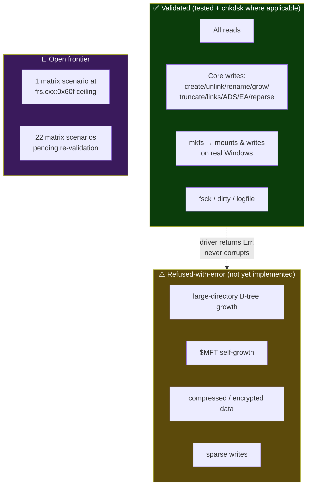

# 08 — Coverage Map & Honest Limits

> *A test-suite document that only lists strengths is marketing. This page exists
> because the most important thing we can tell someone trusting us with
> terabytes is exactly **where the edges are** — so you can decide if your data
> falls inside them. The driver's design rule is to **fail fast with an error**
> at every edge below, never to guess.*

This crate is in **active development and is not yet 1.0.** That is stated up
front so nothing here reads as a surprise.

---

## What is validated today

These are exercised by the test layers in [02–07](02-read-path.md) and, where
noted, by the real-Windows [`chkdsk` matrix](06-windows-chkdsk-matrix.md).

```
   READ   ✅  every read path the upstream ntfs 0.4 parser supports:
              stat · readdir · file content (resident / non-resident /
              fragmented) · ADS · EAs · reparse / symlink / junction ·
              object ID · Unicode names · volume stats · sparse reads

   WRITE  ✅  resident + non-resident $DATA writes · resident→non-resident
              promotion · grow / truncate (with zero-fill) · create · unlink ·
              mkdir · rmdir · rename (same- & variable-length) · hard links ·
              ADS write/delete · reparse / symlink write · EA write ·
              timestamps · file-attribute flags · object-id write ·
              volume-label write

   FORMAT ✅  pure-Rust mkfs: produces volumes ntfs.sys mounts and writes to,
              that chkdsk /scan accepts  (milestones 2026-05-02, 2026-05-24)

   RECOVER ✅ dirty-flag detect + clear · $LogFile reset · volume-version
              upgrade-on-mount · fsck over path and callback transports
```

---

## What is **not** yet supported

Each item below is **detected and refused with an error** — the driver does not
attempt an operation it cannot complete safely. Sources: `README.md`,
`docs/future-features.md`, `docs/missing-functionality.md`.

| Limitation | What happens if you hit it | Why it matters / who it affects |
|---|---|---|
| **Directory overflow into `$INDEX_ALLOCATION`** (B-tree insert/delete) | `create_file` / `mkdir` / `unlink` / `rename` **return an error** when a directory has grown past what fits in its in-MFT `$INDEX_ROOT` | Writing into *very large* directories. Reading them works. (Tracked W3.2 / W3.3.) |
| **`$MFT` self-growth** | `create_file` / `mkdir` **fail-fast** when `$MFT:$Bitmap` is exhausted | Creating files on a volume whose MFT is already full. (Tracked W2.6.) |
| **Compressed `$DATA`** (LZNT1 / WOF) | detect-and-**error** — compressed bytes are *not* returned | Reading files Windows compressed. We refuse rather than return wrong bytes. |
| **Encrypted data (EFS)** | not implemented — read and write **refused** | EFS-encrypted files. |
| **Sparse-aware writes** | reads holes correctly; writes do **not** re-encode sparse runs | Writing to create new sparse regions. |
| **`$AttributeList` overflow** | records spilled into attribute lists **rejected on read** | Heavily fragmented files on old/aged volumes. |
| **USN journal (`$UsnJrnl`)** | mutations are **not** reflected into the change journal | Consumers relying on the USN journal to observe changes. |
| **Transactional NTFS (TxF)** | not implemented (deprecated by Microsoft; not a goal) | — |
| **Volume resize** | not supported — expects a pre-sized image/partition | Growing/shrinking a volume. |
| **Disk-level operations** (partitioning) | not supported — operates at the partition/image level | Partition table editing. |
| **New security-descriptor authoring** | can toggle existing flags / target an existing `$Secure:$SDS` entry; inserting *new* descriptors into the `$Secure` hash-tree is not yet implemented | Setting brand-new ACLs. |
| **Case-sensitive directory collation wire-through** | the comparison primitive exists; the per-directory flag wire-through is pending | Per-directory case sensitivity. |

---

## The concurrency boundary — read this if you embed the driver

> **The driver is single-thread / single-process safe. It is NOT safe under
> concurrent writers to the same image.**

A write is a read-modify-write of on-disk structures. Two writers to the same
image can tear each other's updates and corrupt the volume. This is a documented
design invariant, not a bug — external synchronization is the caller's
responsibility. If you need concurrent access, serialize writes above the driver.

---

## Coverage map at a glance



---

## How limits are kept honest over time

- **The fast suite forbids regressions.** 525 unit + 645 integration tests must
  stay green on every change (`dev-loop` baseline contract).
- **The matrix tracks the frontier in the open.** The 1 failed / 22 pending /
  4 blocked scenarios in [06](06-windows-chkdsk-matrix.md) are visible in
  `test-matrix.json`, with per-iteration evidence — not hidden.
- **Findings are append-only.** `docs/mkfs-bug-catalog.md` and
  `docs/chkdsk-improvement-findings.md` record why each fix was made and what is
  still open.
- **The clean-room rule** keeps the implementation independent: the driver is
  built only from public specifications (Microsoft MS-FSCC, *Windows Internals*)
  and the MIT/Apache `ntfs 0.4` read parser — not from any other implementation.

If you need a feature in the "not yet supported" list, the honest answer is *not
yet* — and the driver will tell you so with an error rather than risking your
data.

---

**Next:** [09 — Reproducing the results →](09-reproducing-results.md)
