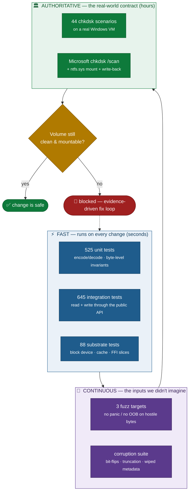

# How `fs-ntfs` Is Tested

> **The short version.** This is a pure-Rust NTFS read/write driver that people
> will point at filesystems holding **terabytes of real data**. A bug here does
> not crash a web page — it loses a wedding album, a research dataset, a backup
> archive. So the test strategy is built around a single, unforgiving question:
>
> **"After we touch a volume, does Microsoft's own `chkdsk` — running on a real
> Windows machine — still say the volume is clean?"**
>
> Everything below exists to answer that question and to catch the bug *before*
> it ever reaches your disk.

This directory documents the complete test and verification strategy for the
crate. It is deliberately split into parts so you can read only the layer you
care about. Every number on this page is reproducible from a command we cite —
nothing here is asserted without a way for you to check it yourself.

---

## The numbers, and how to verify them

Counts current as of **2026-06-01** (repository `HEAD`). Each is a command you
can run. These supersede older figures that may still appear in `README.md` and
`docs/status.md` — the suite has grown faster than those prose docs were updated,
which is exactly why this page leads with reproducible commands instead of prose.

| What | Count | Reproduce it yourself |
|------|------:|-----------------------|
| **Unit tests** (in `src/`, always-runnable gate) | **525** | `cargo test --lib` |
| **Integration tests** (in `tests/`, 89 files) | **645** | `cargo test --tests` |
| **Block-device substrate tests** (`vendor/rust-fs-core`) | **88** | `cargo test -p am-fs-core` |
| **Total automated Rust tests** | **1,258** | (sum of the above) |
| **Fuzz targets** (libFuzzer, continuous) | **3** | `cargo +nightly fuzz run <target>` |
| **Real-Windows `chkdsk` matrix scenarios** | **44** | see [06-windows-chkdsk-matrix](06-windows-chkdsk-matrix.md) |
| **Decoder benchmarks** (regression guard) | 1 suite / 5 groups | `cargo bench --bench byte_decoders` |

```
   $ grep -rhc '#\[test\]' src/*.rs        | paste -sd+ - | bc   →  525
   $ grep -rhc '#\[test\]' tests/*.rs       | paste -sd+ - | bc   →  645
   $ grep -rhc '#\[test\]' vendor/rust-fs-core/tests/*.rs | paste -sd+ | bc → 88
   $ ls fuzz/fuzz_targets/*.rs | wc -l                            →    3
```

> **Honesty note.** The 525 unit tests run anywhere, with no setup — they are the
> gate that is *always* green. Many of the 645 integration tests are
> *fixture-gated*: they need pre-built NTFS disk images that are intentionally
> not committed to git (they are large binaries). On a fresh checkout without
> those fixtures, the fixture-dependent files fail fast — that is by design, not
> a hidden failure. [09-reproducing-results](09-reproducing-results.md) explains
> exactly how to build the fixtures and reproduce a full green run.

---

## The argument in one diagram

The defense against data loss is layered. Each layer catches a different class of
bug, and a bug must pass through *all* of them to reach your disk. Cheap, fast
checks run first and often; the expensive, authoritative check runs last.



The crown jewel is the bottom layer. **We do not validate by comparing our bytes
to some other tool's bytes** — that would only prove we copied someone. We
validate by writing a volume, handing it to a *real* Windows kernel, and asking
*Microsoft's own filesystem checker* whether it is healthy. That is the same
standard your data faces the day you plug the disk into a Windows box.

---

## The test pyramid

```
                          ▲  slow, expensive, authoritative
                          │
                  ┌───────────────┐
                  │  44 chkdsk     │   real Windows ntfs.sys + chkdsk /scan
                  │  VM scenarios  │   "does Microsoft agree it's clean?"
                  └───────────────┘
              ┌───────────────────────┐
              │  20+ corruption /      │   hostile & malformed input
              │  fuzz / panic-safety   │   "never crash, never corrupt"
              └───────────────────────┘
        ┌───────────────────────────────────┐
        │   645 integration tests (89 files) │   public API, end-to-end,
        │   read • write • round-trip • FFI  │   two independent parsers agree
        └───────────────────────────────────┘
   ┌─────────────────────────────────────────────────┐
   │   525 unit tests + 88 substrate tests             │  byte-level invariants,
   │   encode/decode, bitmaps, data runs, MFT fixup    │  the foundation
   └─────────────────────────────────────────────────┘
                          │
                          ▼  fast, cheap, runs constantly
```

---

## How to read this set

Each document stands alone. Pick your entry point:

| If you want to know… | Read |
|----------------------|------|
| **Why should I trust this with my data?** | [01 — Strategy & the validation contract](01-strategy-and-the-contract.md) |
| How reads (stat, dir listing, file content, ADS, EAs…) are proven correct | [02 — The read path](02-read-path.md) |
| How writes (create, delete, rename, grow, truncate, links…) are proven safe | [03 — The write path](03-write-path.md) |
| How the raw on-disk format (data runs, MFT, bitmaps, every field) is tested | [04 — On-disk format & field exhaustion](04-on-disk-format.md) |
| What happens when the disk is **corrupted or hostile** | [05 — Robustness, corruption & fuzzing](05-robustness-and-fuzzing.md) |
| The **real-Windows `chkdsk`** validation matrix — the heart of the argument | [06 — The Windows `chkdsk` matrix](06-windows-chkdsk-matrix.md) |
| The block-device substrate and the C ABI / FFI surface | [07 — Substrate & C ABI](07-substrate-and-c-abi.md) |
| **What is NOT yet tested or supported** (we tell you plainly) | [08 — Coverage map & honest limits](08-coverage-and-honest-limits.md) |
| How to run all of this yourself | [09 — Reproducing the results](09-reproducing-results.md) |

---

## The five principles behind every test

1. **Validate against the real world, not against ourselves.** The final word
   belongs to Microsoft's `chkdsk` and `ntfs.sys`, on a real Windows VM — not to
   our own reader agreeing with our own writer.
2. **Two independent parsers must agree.** Write with our code; read it back with
   an *independent* read-only parser (`ntfs = "0.4"`, Colin Finck's MIT/Apache
   crate). A write bug that our own reader happens to tolerate is still caught,
   because the independent parser will reject it.
3. **Never panic, never corrupt — even on garbage input.** Hostile or truncated
   images must produce a clean `Err`, never a crash and never silent corruption.
   This is enforced by fuzzers and a dedicated corruption suite.
4. **Exhaust the boundaries.** Every on-disk field is round-tripped at its limits
   — 0 bytes, 1 byte, exactly at a threshold, one byte over. Off-by-one is where
   filesystem corruption lives.
5. **Be honest about the edges.** Where a feature is not yet implemented or not
   yet validated, the driver *fails fast with an error* rather than guessing — and
   [document 08](08-coverage-and-honest-limits.md) lists every such edge plainly.

---

## What this suite does **not** claim

We would rather under-promise. This crate is in active development and is not yet
1.0. It does **not** yet support, for example, writing to directories large
enough to overflow their in-MFT index, self-growing the `$MFT`, decompressing
compressed streams, or concurrent writers to the same image. Each limitation is
enumerated, with its consequence, in
[08 — Coverage map & honest limits](08-coverage-and-honest-limits.md). The driver
detects these cases and returns an error rather than risking your data.
